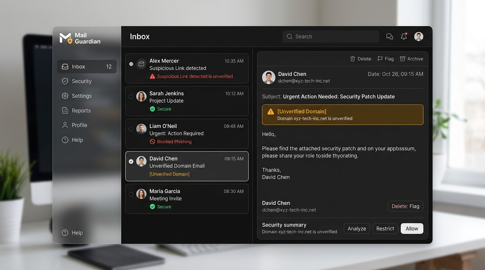

<div align="center">

  <h1>🛡️ Security Guard / Mail Guardian</h1>
  <p><strong>Open-Source, Privacy-First Email Security & Threat Intelligence Platform</strong></p>

  <p>
    <a href="#-key-features">Key Features</a> •
    <a href="#-visual-interface-showcase">UI Showcase</a> •
    <a href="#-architectural-overview">Architecture</a> •
    <a href="#11-running-locally">Quick Start</a> •
    <a href="#16-roadmap-summary">Roadmap</a>
  </p>

  <p>
    
    
    
    
    
    
  </p>

</div>

---

## 🖼️ Visual Interface Showcase

### 🌙 Dark Glassmorphic Dashboard (Option 1 Default Theme)
*Features frosted-glass navigation, subtle border accents, high-contrast legibility, and real-time threat badges.*



---

### ☀️ Light Mode Interface
*Clean high-contrast light theme with floating security analysis modals and intuitive signal badges.*


---

# 1. Project Vision

Traditional email clients primarily focus on delivering and organizing messages. Inbox Security is intended to add a **security-first layer** on top of that experience.

The system should eventually be able to:

1. Receive or import an email from a supported provider.
2. Normalize it into a common internal email format.
3. Analyze it using deterministic security rules.
4. Produce a security assessment and explain the reasons behind it.
5. Optionally use an LLM to provide a more natural-language explanation.
6. Allow the user to manage the email normally through inbox, sent, drafts, spam, trash, etc.

The important architectural principle is:

```text
Email Provider
      ↓
Provider Adapter
      ↓
Normalized Email
      ↓
Deterministic Security Engine
      ↓
Security Analysis
      ↓
Optional LLM Explanation
      ↓
Security Guard UI
```

The security engine should **not depend on an LLM**.

This makes the core security analysis deterministic, reproducible, testable, and usable even when no AI API key is available.

---

# 2. Current Product

The application currently runs as a **Demo Application**.

Demo Mode exists so that the complete Security Guard interface can be developed and tested without requiring:

* Gmail credentials
* Microsoft/Outlook credentials
* IMAP credentials
* OpenAI API keys
* Gemini API keys
* Claude API keys
* Grok/xAI API keys
* Any other external AI service

The demo application uses controlled placeholder/sample email data to simulate an email environment.

The purpose of Demo Mode is not to pretend that the application is connected to a real mailbox.

It is a **fully local demonstration environment** for the email UI and security architecture.

---

# 3. Development Roadmap

The project is divided into seven phases.

## Phase 1 — Foundation / Cleanup

### Goal

Understand the original Replit project, preserve the existing UI, and establish a clean architectural foundation.

Main responsibilities:

* Understand existing code
* Preserve the existing visual design
* Clean project structure where necessary
* Identify frontend/backend boundaries
* Remove unnecessary prototype-specific coupling
* Establish a maintainable workspace

---

## Phase 2 — Security Guard Transformation

### Goal

Transform the original NUV-specific prototype into a generic email-security product.

Responsibilities:

* Remove NUV-specific identity where appropriate
* Establish generic product concepts
* Preserve useful existing UI
* Establish the Security Guard identity
* Prepare the application for future provider integrations

The project should not become tied to one university, organization, or email provider.

---

## Phase 3 — Security Architecture ✅

### Goal

Create the security architecture that future email providers and AI providers can plug into.

The core architecture consists of three major layers.

### Deterministic Security Engine

The deterministic engine performs security analysis without relying on an LLM.

Examples of security signals include:

* External sender
* Suspicious language
* Urgency
* Credential/login requests
* Suspicious link characteristics
* Trusted-domain status
* Other deterministic security indicators

The engine should produce structured results rather than UI-specific output.

For example, conceptually:

```text
Email
  ↓
Security Engine
  ↓
{
  riskLevel,
  score,
  reasons[],
  signals[],
  recommendations[]
}
```

The exact implementation should remain independent from the UI.

### Email Provider Abstraction

Email providers should not directly control the rest of the application.

Instead:

```text
Gmail
Outlook
IMAP
...
 ↓
Provider Adapter
 ↓
Common Email Model
```

This allows the rest of Security Guard to operate on normalized email data.

### LLM Abstraction

LLMs are treated as optional providers.

Conceptually:

```text
OpenAI
Gemini
Claude
Grok
Compatible APIs
      ↓
LLM Provider Interface
      ↓
Security Guard
```

The deterministic security engine remains independent from these providers.

LLMs are intended primarily for enhanced explanations and AI-assisted analysis rather than being the sole source of truth for security decisions.

---

# 4. Phase 4 — Complete Demo Application

### Goal

Make Security Guard a complete and usable email-client-style application **without requiring API keys or external email accounts**.

The demo application should provide the complete UI and interaction model needed before real provider integrations are introduced.

Target areas:

### Dashboard

Should provide an overview of the mailbox and security state.

Potential information includes:

* Inbox statistics
* Security statistics
* Recent suspicious emails
* Security alerts
* Mail activity
* Other useful mailbox summaries

### Inbox

The main email list.

Should support:

* Email listing
* Sender
* Subject
* Timestamp
* Read/unread state
* Security indicators
* Selection/navigation
* Consistent email interactions

### Email Detail

Opening an email should provide:

* Sender information
* Recipient information
* Subject
* Message content
* Timestamp
* Security status
* Security reasons
* `"See Why?"` functionality
* Relevant warnings/signals

### Sent

A dedicated sent-mail view.

### Drafts

A dedicated drafts view.

### Spam

A dedicated spam view with appropriate security context.

### Trash

A dedicated trash view.

### Settings

Settings should provide the application's configuration experience.

This includes security-related configuration such as trusted domains.

### Trusted Domains

Users should be able to manage trusted domains.

Trusted-domain status should influence deterministic security analysis.

For example:

```text
Trusted domain
      ↓
Known sender/domain
      ↓
Reduced external-sender suspicion
```

Removing a domain from the trusted list should allow emails from that domain to be treated as untrusted/external when appropriate.

### Security Analysis / "See Why?"

Security analysis should be understandable to users.

Instead of simply displaying:

```text
⚠ Suspicious
```

the application should explain why the email was flagged.

For example:

```text
Security concerns detected:

• External sender
• Urgency detected
• Credential/login request detected
• Suspicious link characteristics detected
```

The exact security logic should come from the deterministic security engine.

### Demo Mode

Demo Mode should:

* Work without API keys
* Work without Gmail/Outlook authentication
* Provide realistic sample emails
* Exercise the application's UI
* Exercise security-analysis behavior
* Provide predictable results
* Make it obvious that the mailbox is simulated

Demo Mode should not require developers to create external accounts just to see the application.

### Navigation and UI

The application should have consistent navigation across:

```text
Dashboard
Inbox
Sent
Drafts
Spam
Trash
Settings
```

The existing UI should be preserved and improved rather than unnecessarily rebuilt.

### Placeholder States

Where a feature is not yet backed by a real provider, the UI should use clear placeholder/demo states rather than pretending that a live integration exists.

---

# 5. Phase 5 — Real Email Providers

### Goal

Connect Security Guard to actual email accounts.

This phase introduces real mailbox functionality.

Potential providers:

* Gmail
* Outlook / Microsoft
* IMAP-compatible providers

### OAuth

Provider authentication should use appropriate OAuth flows where supported.

Responsibilities include:

* Authorization
* Callback handling
* Access-token management
* Refresh-token handling
* Secure token storage
* Account connection/disconnection

### Email Fetching

The provider layer should retrieve real emails and convert them into the application's normalized email model.

```text
Provider API
     ↓
Provider Adapter
     ↓
Normalized Email
     ↓
Security Engine
     ↓
Security Guard UI
```

### Sending

Real email sending should be implemented through the appropriate provider APIs/protocols.

### Drafts

Draft creation and synchronization should eventually be provider-backed.

### Folders

Provider-specific folders/labels should be normalized where possible.

Examples:

```text
Inbox
Sent
Drafts
Spam
Trash
```

Different providers may use different underlying concepts, so the provider abstraction must handle those differences.

### Provider-Specific Normalization

The rest of the application should not need to know whether an email originated from:

```text
Gmail
Outlook
IMAP
```

The adapter should normalize provider-specific structures into the common internal model.

---

# 6. Phase 6 — Real LLM Integration

### Goal

Connect the existing LLM abstraction to real AI providers.

Potential providers:

* OpenAI
* Google Gemini
* Anthropic Claude
* xAI Grok
* Compatible APIs

The LLM layer should remain modular.

Conceptually:

```text
Security Guard
      ↓
LLM Abstraction
      ↓
Provider
 ┌────┼────┬────┬────┐
 ↓    ↓    ↓    ↓    ↓
OpenAI Gemini Claude Grok ...
```

### AI-Assisted Explanations

LLMs can be used to turn structured security findings into understandable explanations.

For example:

```text
Deterministic Engine:

Risk: High

Signals:
- External sender
- Urgency detected
- Credential request
- Suspicious URL
```

The LLM can then produce a user-friendly explanation such as:

> This email appears risky because it creates urgency, asks for credentials, and contains a suspicious link from an external sender.

The LLM should **not silently replace deterministic security decisions**.

### API-Key Handling

API keys must never be hardcoded into the repository.

Keys should be:

* Supplied through secure configuration
* Stored securely where persistence is required
* Excluded from Git
* Never committed to the public repository
* Never exposed unnecessarily to the frontend

---

# 7. Phase 7 — Hardening / Release

Phase 7 is the final engineering and release stage.

Areas include:

### Testing

* Unit tests
* Integration tests
* Security-engine tests
* Provider tests
* UI tests
* Demo-mode tests
* Regression testing

### Security Review

Review:

* Authentication
* Authorization
* Token handling
* API-key handling
* Input validation
* URL analysis
* XSS risks
* CSRF considerations
* Dependency security
* Sensitive data exposure
* Logging

### Error Handling

The application should handle:

* Provider failures
* Network failures
* Authentication expiration
* Invalid email data
* AI provider failures
* Missing configuration
* Rate limits
* Unexpected API responses

without crashing the entire application.

### Documentation

The final project should document:

* Architecture
* Local development
* Environment variables
* Provider setup
* LLM setup
* Security engine
* Contribution workflow
* Deployment

### Deployment / Packaging

Prepare the project for reproducible deployment and open-source distribution.

---

# 8. Architecture

At a high level:

```text
                         ┌─────────────────────┐
                         │   Security Guard UI │
                         └──────────┬──────────┘
                                    │
                                    ▼
                         ┌─────────────────────┐
                         │ Application Layer   │
                         └──────────┬──────────┘
                                    │
                    ┌───────────────┴───────────────┐
                    ▼                               ▼
          ┌──────────────────┐             ┌──────────────────┐
          │ Email Provider   │             │ LLM Provider     │
          │ Abstraction      │             │ Abstraction      │
          └────────┬─────────┘             └────────┬─────────┘
                   │                                │
          ┌────────┼────────┐              ┌────────┼────────┐
          ▼        ▼        ▼              ▼        ▼        ▼
       Gmail   Outlook    IMAP          OpenAI   Gemini   Claude
                                                   ...
                   │
                   ▼
          ┌──────────────────┐
          │ Normalized Email │
          └────────┬─────────┘
                   │
                   ▼
          ┌──────────────────┐
          │ Deterministic    │
          │ Security Engine  │
          └────────┬─────────┘
                   │
                   ▼
          ┌──────────────────┐
          │ Security Result  │
          │ + Signals        │
          │ + Risk           │
          │ + Reasons        │
          └──────────────────┘
```

The critical architectural rule is that the **security engine should remain provider-agnostic and LLM-independent**.

---

# 9. Repository Structure

The repository is currently organized as a pnpm workspace.

```text
INBOX-SECURITY/
│
├── artifacts/
│   ├── api-server/
│   │   └── Express API backend
│   │
│   ├── mockup-sandbox/
│   │   └── Mockup / sandbox environment
│   │
│   └── nuv-mail-guardian/
│       └── Main Security Guard frontend
│
├── lib/
│   ├── api-client-react/
│   ├── api-zod/
│   ├── db/
│   └── integrations/
│
├── scripts/
│
├── screenshots/
│
├── package.json
├── pnpm-lock.yaml
├── pnpm-workspace.yaml
├── tsconfig.json
└── tsconfig.base.json
```

> **Note:** `artifacts/nuv-mail-guardian` is currently the technical package/directory name inherited from the original project structure. The application/product itself is referred to as **Security Guard**.

---

# 10. Technology Stack

The project currently uses a TypeScript-based web stack.

### Frontend

* React
* TypeScript
* Vite
* Tailwind CSS
* Radix UI
* React Query
* Wouter
* Framer Motion
* Lucide React
* Recharts
* Zod

### Backend

* Node.js
* TypeScript
* Express
* Drizzle ORM
* Zod
* Pino

### Workspace

* pnpm
* pnpm workspaces
* TypeScript project references

---

# 11. Running Locally

## Requirements

Install:

* Node.js 20+
* pnpm

Verify:

```bash
node -v
pnpm -v
```

## Install dependencies

From the repository root:

```bash
pnpm install
```

## Start the frontend

The current frontend package is:

```text
@workspace/nuv-mail-guardian
```

For local Windows development, the current Vite configuration expects `PORT` and `BASE_PATH`.

### Windows CMD

```cmd
set PORT=5173
set BASE_PATH=/
pnpm --filter @workspace/nuv-mail-guardian dev
```

Then open:

```text
http://localhost:5173/
```

The exact technical package name may change in a future cleanup; the application itself should be referred to as **Security Guard**.

---

# 12. Demo Mode

Demo Mode is intentionally designed to work without external credentials.

It provides sample/placeholder emails so that the following can be demonstrated locally:

* Inbox navigation
* Email detail
* Security indicators
* Trusted-domain behavior
* Security explanations
* Dashboard behavior
* Other mailbox UI functionality

Example security signals include:

```text
External sender
Suspicious language detected
Urgency detected
Credential/login request detected
Suspicious link characteristics detected
```

The deterministic security engine should be used wherever security decisions are being simulated.

---

# 13. Security Philosophy

Inbox Security is fundamentally built around the principle:

> **Deterministic security first, AI second.**

An LLM can explain a security decision, assist the user, or provide additional context.

It should not be the only component deciding whether an email is dangerous.

This provides:

* Reproducibility
* Explainability
* Lower API dependency
* Better testing
* Offline/demo capability
* Provider independence
* Easier auditing

---

# 14. Development Principles

When modifying the project:

### Preserve the existing UI

Do not rebuild working screens from scratch without a reason.

### Keep security logic separate

Do not put security-analysis logic directly inside React components.

Prefer:

```text
Email
 ↓
Security Engine
 ↓
Structured Result
 ↓
UI
```

rather than:

```text
React Component
 ↓
random security logic
 ↓
UI state
```

### Keep providers abstract

The application should not become tightly coupled to Gmail, Outlook, or any individual provider.

### Keep LLMs optional

The application must remain useful without an AI API key.

### Do not commit secrets

Never commit:

```text
API keys
OAuth secrets
Access tokens
Refresh tokens
Passwords
Private credentials
```

to the repository.

### Avoid unnecessary rewrites

Before replacing an existing module, understand why it exists and whether another part of the application depends on it.

---

# 15. Long-Term Goal

The final Security Guard architecture should look roughly like:

```text
                    SECURITY GUARD
                          │
          ┌───────────────┼────────────────┐
          │               │                │
          ▼               ▼                ▼
       Email UI      Security Engine    AI Layer
          │               │                │
          │               │        ┌───────┼────────┐
          │               │        ▼       ▼        ▼
          │               │      OpenAI  Gemini   Claude
          │               │                 │       ...
          │               │
          ▼               │
   Provider Layer         │
          │               │
     ┌────┼────┐          │
     ▼    ▼    ▼          │
   Gmail Outlook IMAP      │
     │    │    │          │
     └────┴────┴──────────┘
              │
              ▼
       Normalized Email
              │
              ▼
     Deterministic Analysis
              │
              ▼
       Security Result
              │
              ▼
          Security UI
```

The project should ultimately function as a **provider-independent, security-first email client** where real mailbox integrations and AI capabilities can be added without rewriting the core application.

---

# 16. Roadmap Summary

| Phase   | Description                   | Status   |
| ------- | ----------------------------- | -------- |
| Phase 1 | Foundation / Cleanup          | Complete |
| Phase 2 | Security Guard Transformation | Complete |
| Phase 3 | Security Architecture         | Complete |
| Phase 4 | Complete Demo Application     | Complete |
| Phase 5 | Real Email Providers          | Complete |
| Phase 6 | Real LLM Integration          | Complete |
| Phase 7 | Hardening / Release           | Complete |

---

# 17. Important Naming

### Repository

**INBOX-SECURITY**

### Current application/UI name

**Security Guard**

### Current technical frontend package

```text
@workspace/nuv-mail-guardian
```

The technical package name is legacy structure and should not be confused with the current product identity.

A future cleanup may rename the package and directories to remove the remaining NUV-specific naming.

---

# 18. Final Objective

Inbox Security is not intended to remain a static email mockup.

The intended evolution is:

```text
Prototype
   ↓
Security Guard Demo
   ↓
Provider-Agnostic Email Architecture
   ↓
Real Gmail / Outlook / IMAP
   ↓
Optional AI Assistance
   ↓
Hardened Open-Source Security Application
```

The current priority is to build each layer cleanly so that later phases can be added without having to rewrite the entire application.
